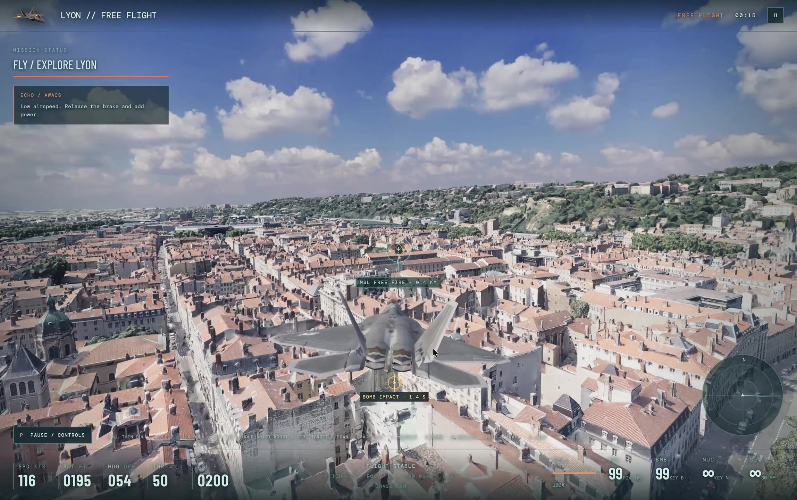
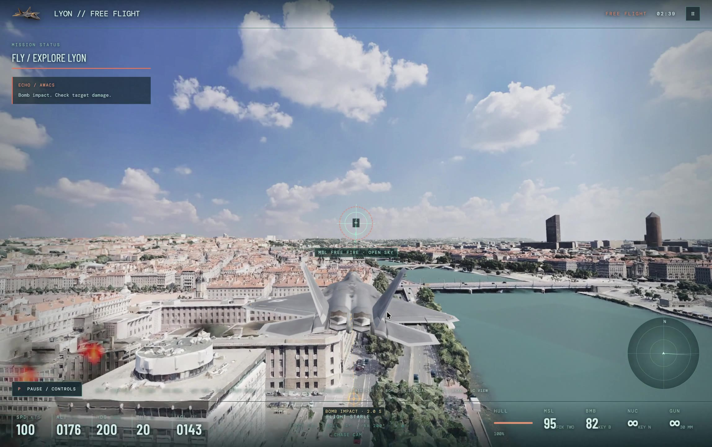

# Skyfall Protocol

**Skyfall Protocol is a fully vibe-coded AAA+ air-combat game that runs entirely in desktop Chrome for free.** Fly seven modern aircraft over a textured 3D Lyon, fight through a four-act campaign mission, or explore the city in free flight. This is a playable prototype, with AAA+ as its visual and gameplay ambition.

This project asks how far modern browser graphics and AI-assisted development can go. The challenge was to direct and playtest the game through prompts and visuals, without manually reading the implementation code. WebGPU, local map storage, open city data, and off-the-shelf aircraft assets made a browser-only version possible without an API key, billing account, or game installation.

## Gameplay video

**Click to play ^**

## Screenshots

### Low flight over Lyon

### River approach

### Low flight

## Play in Chrome

Open **[Skyfall Protocol on GitHub Pages](https://a7ul.github.io/skyfall/)** in desktop Chrome, then follow the launch screen:

| Step | What to do |
| --- | --- |
| **1 · Choose map** | Select **Lyon**. Download every map ZIP part into the same folder, then choose that folder in Chrome and grant read/write access. The game validates and prepares the city locally. |
| **2 · Choose flight** | Pick **Operation Nightglass** for the story mission or **Free Flight** to explore and practice. |
| **3 · Choose aircraft** | Select one of seven jets. The chosen aircraft appears over the Lyon preview. |
| **4 · Start game** | Launch when the starting city area is ready. Finer tiles load from the selected folder as you fly. |

The folder selection is remembered for the same browser and site across refreshes. Chrome may ask you to reconnect permission, but you should not need to browse to the folder again. The map pack is a **central Lyon snapshot**; areas outside the captured tiles cannot acquire extra detail. The game needs a WebGPU-capable desktop Chrome build with GPU acceleration and enough free disk space to unpack the map. There are no company API keys or usage charges.

#### Setup video tutorial

<video src="https://github.com/user-attachments/assets/6e807316-f05f-473f-80f0-1b9f35f79319" width="320" height="240" controls></video>

## The game

**Operation Nightglass** follows Viper One after Sable seizes Lyon's evacuation frequencies and traps Mercy Seven's relief convoy beside the Rhône. The convoy carries evidence that Sable shot down a relief plane. Across one sortie, you disable two jammers, survive an aerial ambush, face commander Wraith, and open an exit corridor for the convoy.

**Free Flight** opens the same city without the campaign objective. Fly low over the river and streets, practice rolls and inverted flight, switch cameras, and use the weapons freely.

| Flight | Combat | City |
| --- | --- | --- |
| Separate pitch, roll, and yaw; aircraft-specific handling; throttle, air brake, stalls, and animated control surfaces. | Cannon, guided or unguided missiles, gravity bombs, and a stylized special weapon. Surface impacts create different water, road, and building effects. | 2023 Lyon photomesh with progressive detail, road traffic, ground targets, and an approximate collision field. |

The seven playable aircraft are the **F-22 Raptor, F-35 Lightning II, Su-57 Felon, Su-35 Flanker-E, F-15E Strike Eagle, F-16 Fighting Falcon, and A-10 Thunderbolt II**. Their game flight profiles keep different roles while compressing real-world speed for city flying. This is an arcade air-combat game, not a flight-training simulation.

## Tech stack

| Layer | Technology | Role in the game |
| --- | --- | --- |
| Rendering | **WebGPU** through **Three.js WebGPURenderer** | Aircraft, city, lighting, particles, and effects. The game has no WebGL fallback. |
| World | **3D Tiles Renderer** and the **Métropole de Lyon 2023 photomesh** | Streams higher detail near the aircraft from local map files. |
| Local storage | **Chrome File System Access API** and **IndexedDB** | Lets players choose a map folder, reuse prepared tiles, and reconnect it after refresh. |
| Map packaging | **ZIP parts** and **zip.js** | Validates the downloaded pack and extracts tiles in parallel before flight. |
| Aircraft | **glTF / GLB** models | Seven textured fighter models with animated control surfaces and exhaust effects. |
| Gameplay | **JavaScript modules** | Flight tuning, targeting, weapons, traffic, mission logic, collisions, audio, and damage effects. |
| Tooling | **Vite, Bun, Git LFS** | Local development and production builds; large aircraft and environment assets are tracked with LFS. |

The city mesh comes from [Métropole de Lyon](https://www.data.gouv.fr/datasets/photomaillage-3d-de-la-metropole-de-lyon) under the French Open Licence 2.0. Road and building data are credited to [OpenStreetMap contributors](https://www.openstreetmap.org/copyright). Map ZIPs stay outside the Git repository; the browser reads the chosen local folder during play. See [Lyon map data](docs/data/lyon-map.md) for coverage and packaging limits.

## Tested setup

Browser and build checks have been run on an **Apple M4 Mac mini, 16 GB unified memory**, with desktop Chrome and WebGPU enabled. This is the hardware reported by the development machine. It is not a MacBook Pro benchmark, and no minimum hardware specification or frame-rate guarantee has been established.

## Run locally

Install [Bun](https://bun.sh/) and [Git LFS](https://git-lfs.com/), then run:

~~~sh
git clone git@github.com:a7ul/skyfall.git
cd skyfall
git lfs pull
bun install
bun run dev
~~~

Open the URL printed by Vite in desktop Chrome. Local development and the hosted build use the **same folder-based map reader**. The large map ZIPs are not in Git. For development on a machine with an existing converted Lyon cache, create them with <code>bun run map:pack:lyon</code>; otherwise download the map pack from the game. Keep all ZIP parts in one folder and choose that folder in the game. To check a production build, run <code>bun run build</code> followed by <code>bun run preview</code>.

### Flight controls

| Input | Action |
| --- | --- |
| W / S or ↑ / ↓ | Nose down / up |
| A / D | Roll left / right |
| Q / E or ← / → | Yaw left / right |
| Hold Shift / Ctrl | Boost and raise throttle / lower throttle; the A-10 has no afterburner |
| Mouse after clicking the game | Pitch and bank |
| Space / left click | Cannon |
| F / right click | Missile, with or without a lock |
| B / N | Gravity bomb / special weapon |
| G / C / M | Hold air brake / change camera / mute |
| P / Esc / HUD button | Pause and show all controls |

Bank with A or D, then pitch into the turn. Holding roll or pitch completes a full roll or loop. Gamepad input is also supported.

## Scope and credits

This is one playable mission and free flight. Destruction, explosions, and collision heights are game approximations. City quality depends on the captured map tiles, altitude, and hardware.

The aircraft are third-party assets under **noncommercial licenses**; review [aircraft attribution](public/assets/aircraft/ATTRIBUTION.md) before redistribution or commercial use. The HDR sky is from [Poly Haven](https://polyhaven.com/a/kloofendal_48d_partly_cloudy_puresky), CC0. See [audio credits](public/assets/audio/CREDITS.md), [flight-model references](docs/design/flight-model.md), [gameplay notes](docs/design/gameplay-design.md), and [afterburner art provenance](docs/art/README.md).
