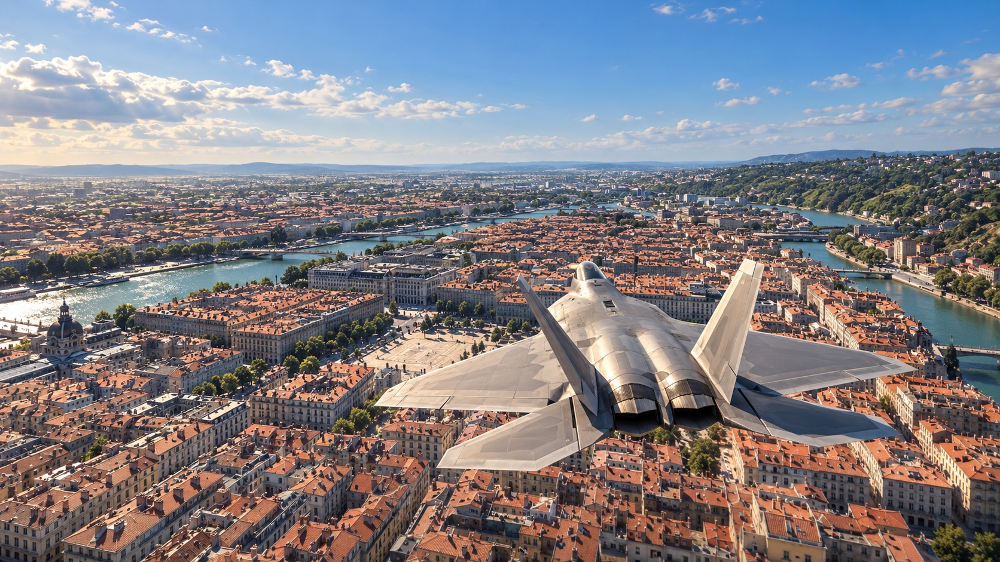
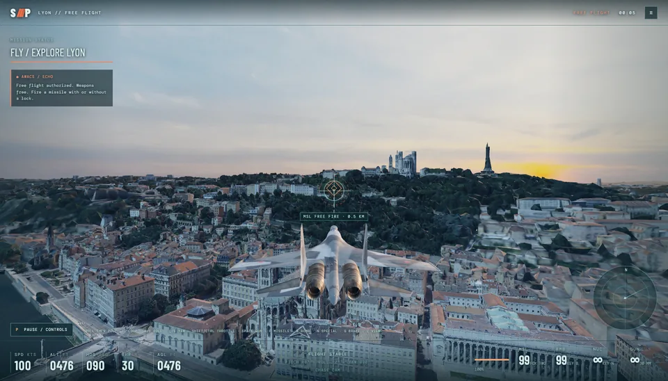
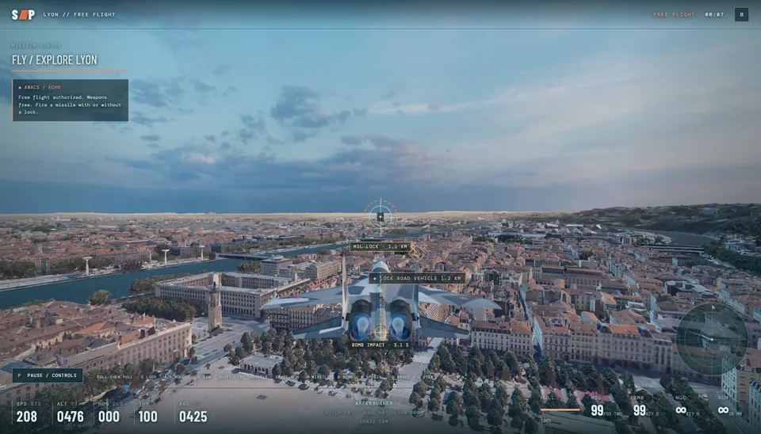
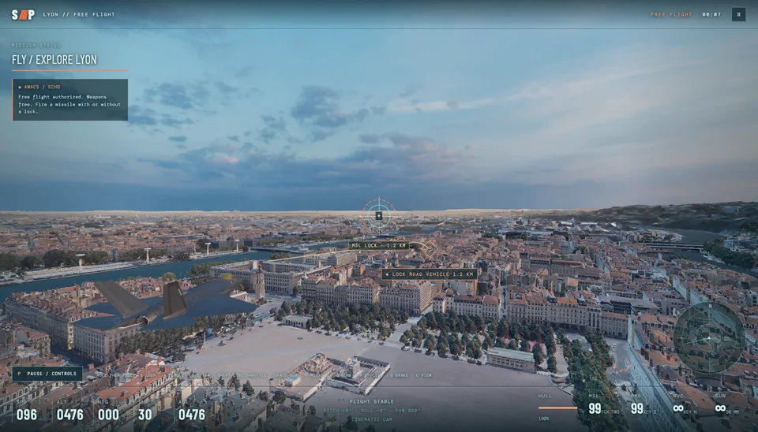
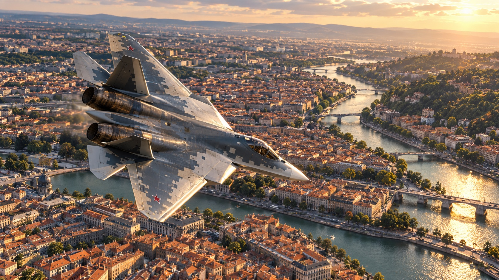
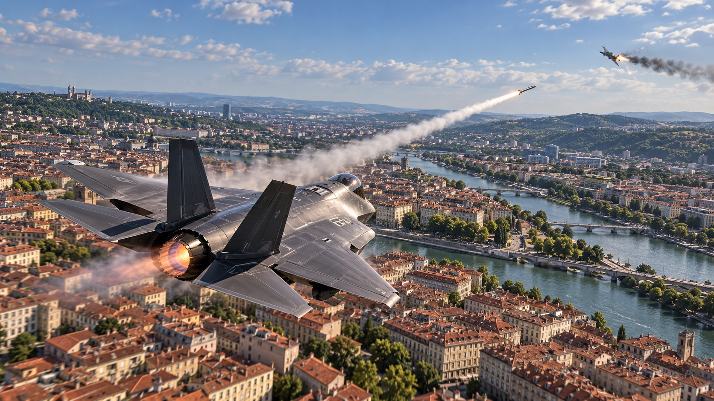

# Skyfall Protocol

**A full air-combat game in your browser.** Fly modern fighter jets, take on air and ground targets, and explore a real 3D city. This first playable build gives you a story mission and free flight over Lyon.

**Lyon is going dark.** Sable has seized the evacuation frequencies and trapped Mercy Seven's relief convoy beside the Rhône. The convoy carries a recorder proving Sable shot down a relief plane. You are Viper One, the last fighter close enough to break the blackout and expose the commander behind it. Choose from seven aircraft, including the F-22, F-35, F-15E, F-16, Su-57, Su-35, and A-10, and take the fight from the open sky down among the rooftops.

[](https://github.com/a7ul/skyfall/releases/download/assets/f22-over-lyon.png)

*Promotional artwork showing the visual direction. Actual gameplay is shown below.*

## Your sortie

### Operation Nightglass — Mission 01

One continuous sortie tells a four-act story through radio exchanges with Echo, Mercy Seven, Viper One, and the opposing pilots:

1. **Cut the Veil:** destroy the two relay sites hiding Sable's position.
2. **Break the Ambush:** fight the first bandit pair that crosses the Rhône.
3. **Defeat Wraith Flight:** face Sable's commander and his wingman.
4. **Open the Corridor:** reach the exit gate and guide Mercy Seven out with the evidence.

The HUD shows each act, its objective, and the active radio speaker. Pause to review the recent mission comms. Wraith has a separate health display and changes course after taking a hit.

### Free flight

Pick a jet and explore without a mission timer. Skim the river, weave between blocks, practice barrel rolls and inverted flight, switch cameras, or test the weapons. Free flight provides ample missiles and bombs and unlimited nuclear bombs.

| In the air | Over the city | In combat |
| --- | --- | --- |
| Separate pitch, roll, and yaw; full rolls and loops; air brake and throttle control; animated control surfaces. | Lyon's textured 3D city streams around you, with finer detail near the aircraft, moving cars, trucks, buses, and pedestrians. | Cannon, lock-on or unguided missiles, gravity bombs, and a stylized nuclear blast. Water splashes, ground craters, and collapsed buildings leave different impact scenes. |

The seven aircraft have different flight tuning. The F-16 is the nimble light fighter, the F-15E is a heavier strike platform, and the slower A-10 is built for low-altitude ground attack. Chase, cockpit, and cinematic views let you change how close you feel to the jet and the streets.

## Actual gameplay

These are captures from the current Lyon build. The city, aircraft, targeting cue, and HUD shown here are in the game. Click an image for the copy in the [media release](https://github.com/a7ul/skyfall/releases/tag/assets).

| Golden-hour skyline | Su-35 at full throttle | F-35 cinematic view |
| --- | --- | --- |
| [](https://github.com/a7ul/skyfall/releases/download/assets/golden-hour-lyon-gameplay.png) | [](https://github.com/a7ul/skyfall/releases/download/assets/su35-afterburner-gameplay.png) | [](https://github.com/a7ul/skyfall/releases/download/assets/f35-cinematic-golden-hour.png) |

## Aircraft and combat artwork

The images below are **generated promotional artwork**, not screenshots or a promise of the current graphics. They show different aircraft and the visual direction for future polish. Click for the full-resolution files in the media release.

| Su-57 over the river | F-35 missile engagement |
| --- | --- |
| [](https://github.com/a7ul/skyfall/releases/download/assets/su57-over-lyon.png) | [](https://github.com/a7ul/skyfall/releases/download/assets/f35-missile-engagement.png) |

## Play locally

You need a desktop Chrome or Edge build with WebGPU and GPU acceleration, [Bun](https://bun.sh/), [Git LFS](https://git-lfs.com/), and an internet connection for Lyon's city tiles. No API key or billing account is required.

```sh
git clone git@github.com:a7ul/skyfall.git
cd skyfall
git lfs pull
bun install
bun run dev
```

Open the URL printed by Vite, choose an aircraft, then select **Launch Mission** or **Free Flight**.

### Flight controls

| Input | Action |
| --- | --- |
| W / S or ↑ / ↓ | Nose down / up |
| A / D | Roll left / right |
| Q / E or ← / → | Yaw left / right |
| Shift / Ctrl | Increase / decrease throttle |
| Mouse after clicking the game | Pitch and bank |
| Space / left click | Cannon |
| F / right click | Missile, with or without a lock |
| B / N | Gravity bomb / nuclear bomb |
| G / C / M | Hold air brake / camera / mute |
| P / Esc / HUD button | Pause and show all controls |

Bank with A or D, then hold S to turn. Hold roll or pitch to complete a full roll or loop. Gamepad controls are supported too.

## Current state

This is a **playable prototype** with one complete mission and free flight. Flight handling favors responsive arcade maneuvers. Building collapse, blast effects, and collision heights are game approximations; the promotional artwork above is more polished than the current renderer. City detail depends on altitude, location, and the tiles loaded around the aircraft.

## Tech stack

- **WebGPU rendering:** Three.js `WebGPURenderer` draws the aircraft, city, HUD effects, and destruction, with HDR sky lighting and ACES tone mapping. There is no WebGL fallback; a WebGPU-capable desktop browser and GPU are required.
- **Streaming 3D world:** `3d-tiles-renderer` loads the 2023 Lyon photomesh progressively. Detail rises near the aircraft and eases back in the distance. OpenStreetMap roads and building footprints support traffic and an approximate collision grid.
- **Aircraft and gameplay:** glTF fighter models, animated control surfaces, and custom flight, targeting, weapons, mission, traffic, audio, and damage systems run in the browser.
- **Build pipeline:** Vite and Bun serve the game locally. `gltf-pipeline` converts Lyon's legacy tile payloads for the renderer; the GitHub Pages build preconverts a bounded static tile pack. Large model and HDR files use Git LFS.

<details>
<summary>Development, city data, and deployment details</summary>

### How the city is built

The visible city is the [Métropole de Lyon 2023 photomesh](https://www.data.gouv.fr/datasets/photomaillage-3d-de-la-metropole-de-lyon), Licence Ouverte / Open Licence 2.0. [OpenStreetMap contributors](https://www.openstreetmap.org/copyright), ODbL, provide road routes and building footprints used for traffic and an approximate collision grid. The mesh streams progressively, with finer tiles near low-altitude flight and lower detail farther away. OSM collision heights can differ from the visible photomesh. See the [city source notes](docs/data/city-source-trials.md).

Local development uses Vite to proxy public Lyon tiles and convert their legacy glTF payloads. The large city mesh is not committed to this repo. The seven aircraft models and HDR sky use Git LFS. Run `bun test` for flight, combat, and world tests; see the [gameplay design notes](docs/design/gameplay-design.md) and [aircraft flight tuning](docs/design/flight-model.md) for sources and limitations.

### GitHub Pages

The repository is private, and its Pages workflow stays skipped on GitHub Free. When the repo becomes eligible, select **Settings → Pages → GitHub Actions**, then run the deployment workflow or push to `main`. The expected URL is `https://a7ul.github.io/skyfall/`.

A local static Pages build is available with `VITE_BASE_PATH=/skyfall/ bun run build:pages`. It creates an approximately 938 MiB preconverted Lyon site in ignored `dist/`. The pack keeps broad lower-detail city coverage and includes another photomesh detail level across a roughly 950 m radius around central Lyon. The finer tiles use Draco geometry compression, with the decoder served from the same static site. The build verifies that every packaged city region has finer child tiles and that all linked models are present. Outside the packaged detailed area, the city remains at the lower-detail level because the full Lyon photomesh exceeds the GitHub Pages site size limit.

</details>

## Credits and licenses

The fighter models are third-party assets with **noncommercial licenses**; check [aircraft attribution](public/assets/aircraft/ATTRIBUTION.md) before redistribution or commercial use. The daylight sky and HDR lighting come from [Poly Haven's Kloofendal 48d Partly Cloudy (Pure Sky)](https://polyhaven.com/a/kloofendal_48d_partly_cloudy_puresky), CC0. Sound sources and licenses are in [audio credits](public/assets/audio/CREDITS.md). The Lyon and OpenStreetMap data retain the licenses linked above.
