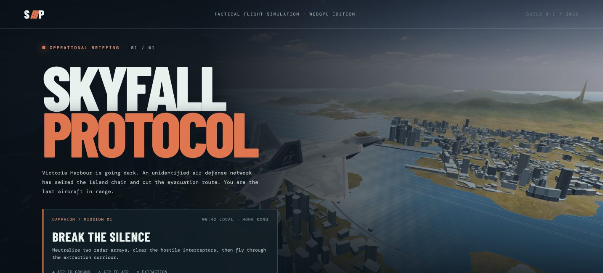
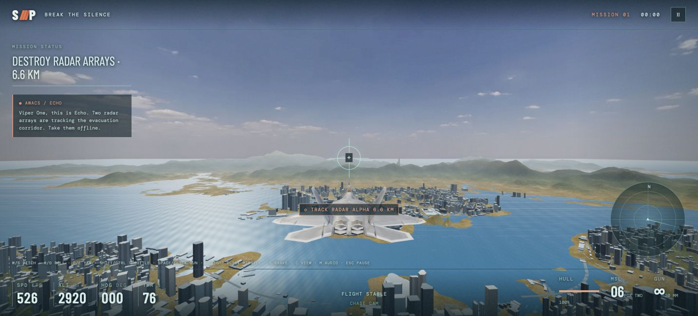
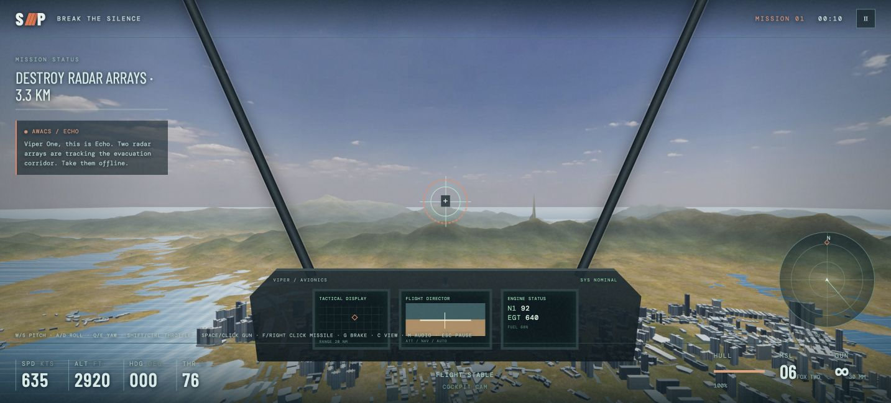
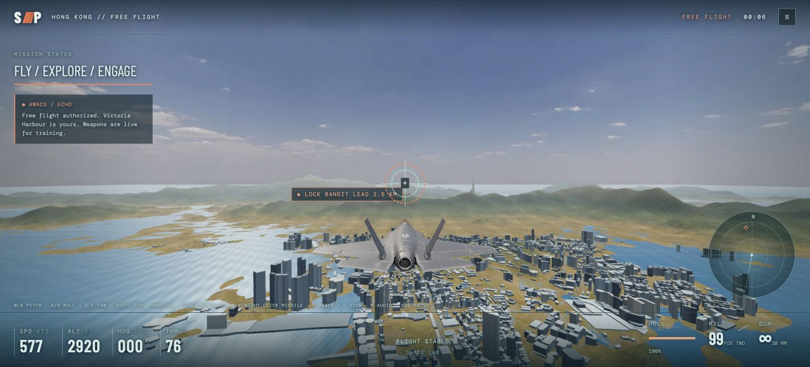

# Skyfall Protocol

**A WebGPU fighter jet game over Lyon.** Fly one story mission or explore freely in an F-22, F-35, Su-57, or Su-35. The city uses Métropole de Lyon's 2023 textured photomesh, streamed as 3D Tiles, with OpenStreetMap roads and building data for traffic and collisions.

> Playable prototype · One mission + free flight · Desktop browser with WebGPU · No API key or billing project

## Screenshots

These captures are from an **earlier Hong Kong prototype**. The current game uses Lyon photomesh; updated Lyon captures are still needed. Click a screenshot to open its copy in the [static `assets` release](https://github.com/a7ul/skyfall/releases/tag/assets). While the repo is private, the README renders its small local copies because GitHub cannot proxy authenticated release images.

| Hangar and mission briefing | Chase camera and target tracking |
| --- | --- |
| [](https://github.com/a7ul/skyfall/releases/download/assets/01-hangar.png) | [](https://github.com/a7ul/skyfall/releases/download/assets/02-chase-lock.png) |
| Cockpit camera | F-35 in free flight |
| [](https://github.com/a7ul/skyfall/releases/download/assets/03-cockpit.png) | [](https://github.com/a7ul/skyfall/releases/download/assets/04-free-flight-f35.png) |

## What is playable

- **Break the Silence:** disable two rogue defense relays, defeat interceptors, and reach the extraction gate over Lyon.
- **Free flight:** explore the city, practice turns and rolls, and use the weapons without mission pressure.
- **Four aircraft:** textured F-22, F-35, Su-57, and Su-35 models with individual flight tuning and animated ailerons, elevators, and rudders.
- **Air and ground combat:** cannon, guided or unguided missiles, gravity bombs, and a stylized nuclear effect. The HUD shows missile and bomb impact cues. Cars, towers, and buildings react to hits.
- **Progressive city detail:** broad low-detail Lyon coverage, with finer tiles around the aircraft and preloading ahead of flight. Roads support moving traffic and pedestrians.

The destruction and flight model aim for a responsive arcade experience. Building collapse, blast effects, and collision heights are visual approximations rather than structural or weapon physics simulations.

## Run locally

Install [Bun](https://bun.sh/) and [Git LFS](https://git-lfs.com/). Use a current Chrome or Edge build with WebGPU and GPU acceleration enabled. An internet connection is needed for Lyon's live city tiles.

```sh
git clone git@github.com:a7ul/skyfall.git
cd skyfall
git lfs pull
bun install
bun run dev
```

Open the URL printed by Vite. Local development and `bun run preview` proxy the public Lyon tiles and convert their legacy glTF 1.0 payloads to glTF 2.0. The repo does not contain the large Lyon photomesh.

## Controls

| Input | Action |
| --- | --- |
| W / S or ↑ / ↓ | Pitch nose down / up |
| A / D | Roll left / right; hold for a full roll |
| Q / E or ← / → | Yaw left / right |
| Shift / Ctrl | Increase / decrease throttle |
| Mouse after clicking the game | Pitch and bank, returning to center |
| Space / left click | Cannon |
| F / right click | Missile; guided after lock, straight ahead without lock |
| B / N | Gravity bomb / nuclear bomb |
| G / C / M | Air brake / camera / mute |
| P / Esc / HUD button | Pause and show controls |

Bank with A or D, then hold S to turn. Holding a roll or pitch input completes a full roll or loop; pitch, yaw, and roll remain separate while inverted. Free flight starts around 55 m/s in the F-22. Gamepad support includes left-stick pitch and bank, shoulder-button yaw, trigger throttle, and face-button weapons.

## How the city works

The [Métropole de Lyon 2023 photomesh](https://www.data.gouv.fr/datasets/photomaillage-3d-de-la-metropole-de-lyon) supplies the visible city under Licence Ouverte / Open Licence 2.0. Its advertised 5.5 cm figure refers to source aerial imagery, not guaranteed facade texture sharpness. [OpenStreetMap contributors](https://www.openstreetmap.org/copyright), ODbL, supply the road routes and building footprints used for traffic and an approximate collision grid. Photomesh roofs and OSM collision heights can differ. See the [city source notes](docs/data/city-source-trials.md) for details.

Tiles load progressively, with finer screen-space detail at low altitude, preloading ahead of the aircraft, a device-sized cache, and frame-time adjustment. Add `?debug=1` during development to inspect tile and frame metrics.

## Project map

| Path | Purpose |
| --- | --- |
| `src/app/` | Game loop, UI, and styling |
| `src/gameplay/aircraft/` | Jet models and control surfaces |
| `src/gameplay/flight/` | Controls and flight dynamics |
| `src/gameplay/combat/` | Weapons, targeting, and destruction |
| `src/world/lyon/` | Tile streaming, traffic, buildings, and collisions |
| `src/mission/`, `src/audio/` | Mission logic and sound |
| `tools/vite/`, `tools/lyon/` | Live tile conversion and static tile-pack build |
| `tests/`, `docs/` | Tests and design/source notes |

Run `bun test` for the flight, combat, and world tests. See [gameplay tuning notes](docs/design/gameplay-design.md) for the design choices and known approximations.

## GitHub Pages build

The repository is currently private. Its Pages workflow stays skipped because GitHub Free does not support Pages for this private repo. When the repo becomes eligible, choose **Settings → Pages → Build and deployment → GitHub Actions**, then run the deployment workflow or push to `main`. The expected site path is `https://a7ul.github.io/skyfall/`.

To build the static site locally:

```sh
VITE_BASE_PATH=/skyfall/ bun run build:pages
```

This downloads and preconverts an approximately 810 MiB Lyon tile pack into ignored `dist/`. Broad city coverage uses lower detail; roughly 2 km around the starting center has finer detail, with the finest tiles in a smaller core. The full 2 km area at maximum detail exceeds GitHub Pages' 1 GB site limit. The build checks tile references and total size before upload. The workflow fetches Git LFS assets before building; generated city tiles are never committed to Git or LFS.

## Credits and licenses

The fighter models are third-party assets with **noncommercial licenses**; review [aircraft attribution](public/assets/aircraft/ATTRIBUTION.md) before redistributing or commercial use. The sky and HDR lighting are adapted from [Poly Haven's Kloppenheim 05](https://polyhaven.com/a/kloppenheim_05_puresky), CC0. Recorded sound sources and licenses are in [audio credits](public/assets/audio/CREDITS.md). Lyon and OpenStreetMap data retain the licenses linked above.
